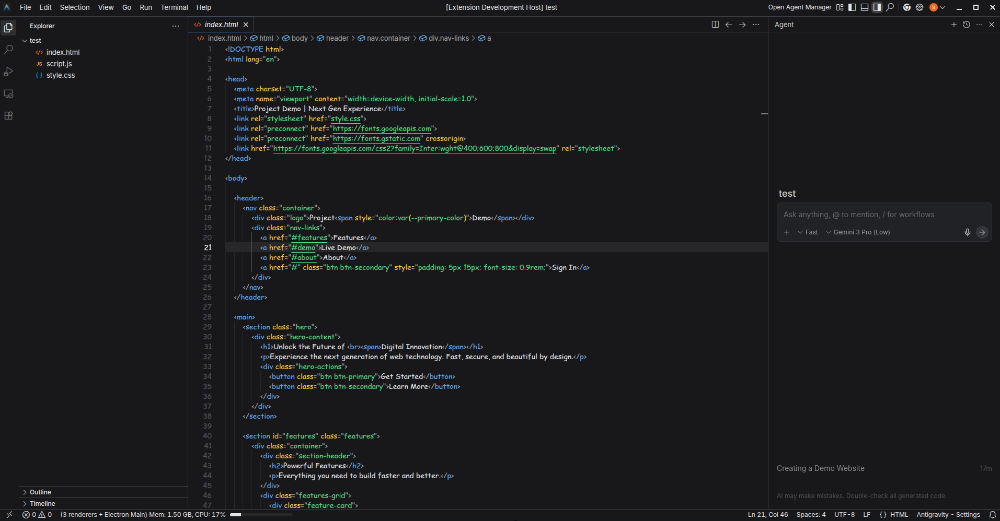

# Aris Theme

Aris is a modern, professional dark theme designed for Visual Studio Code. It features a carefully curated color palette that reduces eye strain while maintaining excellent readability and contrast.

## Features

-   **Deep Dark Background**: `#18181b` background that is easy on the eyes.
-   **Vibrant Syntax Highlighting**: Uses a mix of cool blues, soft greens, and warm accents for clear code differentiation.
-   **Seamless UI Integration**: Consistent colors across the editor, sidebar, and terminal for a unified look.
-   **Focus on Clarity**: High contrast where it matters, subtle tones where it doesn't.

## Screenshots



## Installation

1.  Open **Extensions** sidebar panel in VS Code. `View → Extensions`
2.  Search for `Aris Theme`
3.  Click **Install**
4.  Click **Reload** to restart VS Code
5.  Select `Aris` from the theme list `File > Preferences > Color Theme > Aris`

## Recommended Settings

For the best experience, we recommend the following settings in your `settings.json`:

```json
{
  "editor.fontFamily": "'JetBrains Mono', 'Fira Code', Consolas, monospace",
  "editor.fontSize": 14,
  "editor.lineHeight": 1.6,
  "workbench.iconTheme": "material-icon-theme"
}
```

## Feedback & Issues

If you find any bugs or have suggestions for improvements, please feel free to open an issue on the GitHub repository.

**Enjoy coding with Aris!**
